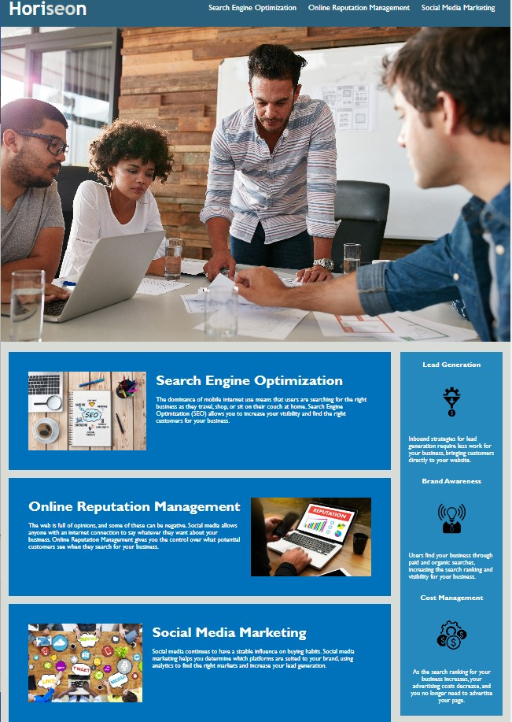

# 1-weekly-challenge

## Description

This repository is where accessability code is added to the Horiseon website. Additional changes include the addition of a descriptive title, the correction of a broken link on the site, and some CSS consolidation. 

## Usage

https://joaqsala.github.io/1-weekly-challenge/

The Horiseon website provides potential clients with information towards improved marketability through search engine optimization, online reputation management, and social media marketing.

This webpage has been updated to work with screen readers.

## Credits

N/A

## License

Please refer to LICENSE in repo

---

